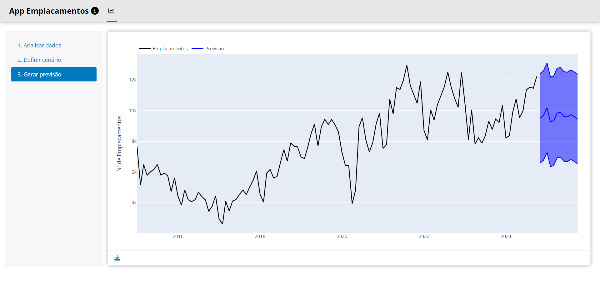
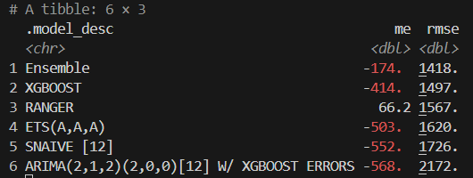
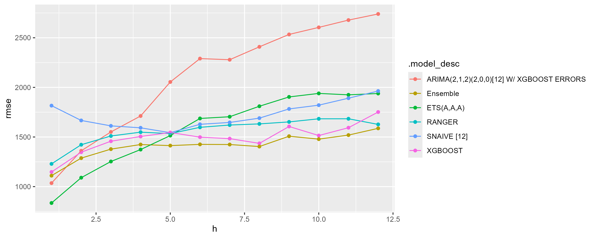
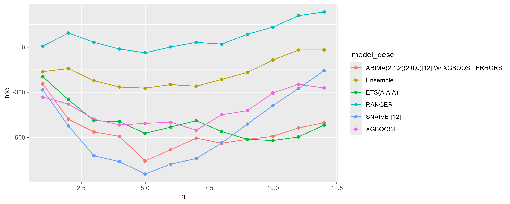

# App Emplacamentos

Este repositório contém arquivos e dados de um aplicativo Shiny de simulação preditiva para o **Total de Emplacamentos de Caminhões** no Brasil, conforme a ANFAVEA.

{fig-align="center"}

## Detalhes técnicos

O aplicativo/modelo preditivo foi desenvolvindo de acordo com a metodologia CRISP-DM, seguindo as seguintes etapas:

-   **Definição do problema**: a tarefa era construir um modelo preditivo para o total de emplacamentos de caminhões, integrando o mesmo em uma dashboard interativa para permitir simulações de cenários.
-   **Coleta de dados**: identificou-se as fontes de dados ANFAVEA, IBGE e BCB e estruturou-se uma base de dados de frequência mensal, contemplando indicadores macroeconômicos, para uso em modelos.
-   **Análise de Dados**: investigou-se as principais características, padrões e relações da variável dependente, encontrando-se estrutura autoregressiva e forte relação com indicadores macroeconômicos.
-   **Modelagem e Previsão**: implementou-se a técnica de validação cruzadda de séries temporais para investigar a generalização de modelos candidatos estatísticos (ARIMA, ETS) e de machine learning (Random Forest, XGBoost), assim como um modelo de base comparativa (Random Walk) e um modelo de meta-aprendizagem (Ensemble).
-   **Validação**: identificou-se que o modelo Ensemble, combinação ponderada dos demais, se generaliza melhor com base em métricas como ME e RMSE, mesmo após avaliar com horizontes preditivos (meses).
-   **Implantação**: desenvolveu-se uma dashboard Shiny interativa para visualizar os indicadores do modelo, personalizar o cenário para variáveis exógenas e produzir previsões para a variável dependente, incluindo previsão média e intervalos de previsão.

Detalhes de acurácia dos modelos:



 

Todo o processo primou pela automação de rotinas.

O código da aplicação está estruturado da seguinte forma:

```         
.
├── .devcontainer                        # Docker container para reprodução online
├── dados                                # arquivos de dados brutos e saídas de código
├── imgs                                 # arquivos de imagem
├── Python                               # arquivos para dashboard Shiny
│   ├── www                              # arquivos estáticos (estilos)
│   ├── app.py                           # dashboard Shiny
├── R                                    # arquivos de estruturação de dados e de modelagem preditiva
│   ├── 00_dependencias.R                # script para instalação de pacotes R
│   ├── 01_base_de_dados.R               # script para estruturar base de dado
│   ├── 02_analise_selecao_variaveis.R   # script para análise exploratória de variáveis
│   ├── 03_validacao_cruzada.R           # script para validação cruzada de séries temporais
│   ├── 04_cenarios.R                    # script para automatizar cenários de exógenas
│   ├── 05_modelo.R                      # script para inferência de parâmetros do modelo final
│   ├── 06_previsao.R                    # script para produzir previsões
├── README.md                            # documentação
├── requirements.txt                     # fixação de dependências Python
```

## Instalação

Siga as etapas abaixo para instalação de softwares necessários para a aplicação:

1.  No repositório GitHub, clique em `Code` \> `Codespaces` \> `Create codespace on main`
2.  No VS Code, instale as dependências:
    a.  Navegue até o arquivo em `R/00_dependencias.R` e execute o código de instalação (`CTRL+A` + `CTRL+ENTER`)
    b.  Abra um Terminal `bash` (`CTRL+SHIFT+C`) e rode o comando: `pip install -r requirements.txt`

## Execução

No VS Code, primeiro rode os scripts R de 01 a 06 e, então, inicie a dashboard com o comando no Terminal `bash` (`CTRL+SHIFT+C`):

```         
shiny run --reload --launch-browser Python/app.py
```

Encerre a aplicação com `CTRL+C` no Terminal. Ao final, delete o Codespace criado em sua conta GitHub.

## Limitações

-   Coleta de dados online: o código utiliza APIs/links para dados em fontes online, não havendo garantias de disponibilidade ininterrupta.
-